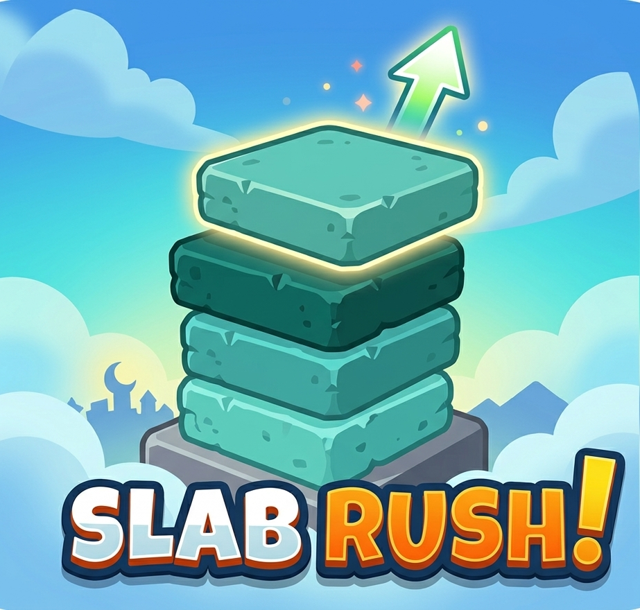

# Slab Rush!

A sleek, minimalist stacking game built with HTML5 Canvas and Vanilla JavaScript. How high can you go?

## Features

- **Satisfying Gameplay**: Stack slabs as high as you can.
- **Dynamic Difficulty**: Block speed increases as you go higher.
- **Economy System**: Earn coins for every successful stack. Total balance is saved locally.
- **Audio Feedback**: Immersive sound effects for placement, speed-ups, and game over.
- **Responsive Design**: Play on desktop or mobile with optimized controls.

## How to Play

- **Desktop**: Press **Space**, **Click**, or **Tap** to place a slab.
- **Mobile**: **Tap** anywhere on the screen.

## Installation / Hosting

1. Clone this repository.
2. Open `index.html` in any modern web browser.
3. To host on GitHub Pages:
   - Go to repository **Settings** -> **Pages**.
   - Select the `main` branch and `/root` folder.
   - Click **Save**.

## Attributions

1. **Chime Sound Effect** by [freesound_community](https://pixabay.com/users/freesound_community-46691455/) from [Pixabay](https://pixabay.com/sound-effects/)
2. **Game over Sound Effect** by [Ribhav Agrawal](https://pixabay.com/users/ribhavagrawal-39286533/) from [Pixabay](https://pixabay.com/sound-effects/)
3. **Swoosh Sound Effect** by [Universfield](https://pixabay.com/users/universfield-28281460/) from [Pixabay](https://pixabay.com/)
4. **Personal Best Sound Effect** by [Universfield](https://pixabay.com/users/universfield-28281460/?utm_source=link-attribution&utm_medium=referral&utm_campaign=music&utm_content=402152) from [Pixabay](https://pixabay.com/sound-effects//?utm_source=link-attribution&utm_medium=referral&utm_campaign=music&utm_content=402152)
5. **CSS Background Patterns** by [MagicPattern](https://www.magicpattern.design/tools/css-backgrounds)
6. **Physics Engine (Matter.js)** by [liabru](https://github.com/liabru/matter-js)

## Support

If you enjoy the game and want to support the developer, feel free to [buy me a coffee on Ko-fi!](https://ko-fi.com/U7U21XXYR2)

## License

This project is licensed under the MIT License - see the [LICENSE](LICENSE) file for details.
